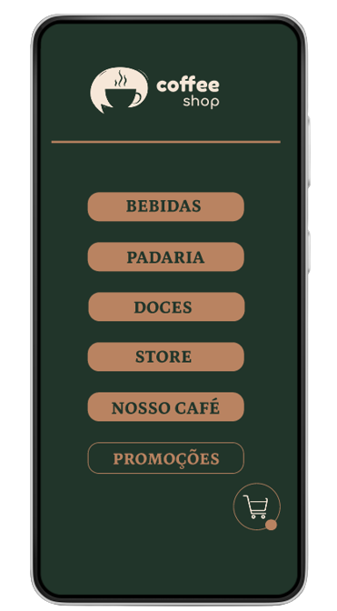
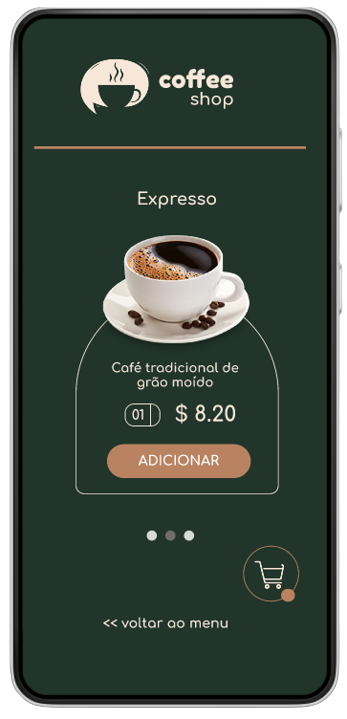

# Coffee_Shop [EM CONSTRUÇÃO]

Projeto desenvolvido com intuito de facilitar o registro dos pedidos dos clientes, 
otimizar a gestão comercial, minimizar o tempo e custos com o serviço e trazer uma experiência de organização e clareza ao usuário.  
Com um painel exposto em seu estabelecimento ou uma simples leitura de QR code (apenas algumas dicas de usuabilidade) o cliente poderá 
efetuar o pedido e o cardápio já estára disponível com as opções de escolha de comer no local, fazer sua retirada ou modo delivery, se houver.  
Devido ao uso do conceito do mobile first*, o software é responsivo para todos os dispositivos, de telas de smartphones até telão.

## Mobile First  

Desde o príncipio o desenvolvimento do projeto já é construido pensando primeiro  nos dispositos móveis.  
É uma verdade que os dispositivos móveis ultrapassou o número de acesso comparado com o Web, mas segundo dados retirados de pesquisas:  
<i>"As pessoas são frequentemente mais impacientes quando navegam em seus telefones. 
Se um site leva muito tempo para carregar, eles não vão esperar mais do que alguns 
segundos. E mesmo assim, eles gastam muito menos tempo navegando no mesmo site."</i> 
Logo não basta seu site ser responsivo, ele tem que ser dinâmico e veloz.

Algumas vantagens: 

<li>Melhor ranqueamento no Google;</li>
<li>Melhor experiência do usuário;</li>
<li>Otimização no carregamento das páginas.</li>

## Projeto no Figma 
https://www.figma.com/file/tJsP9C9WtnAWR6WlgdHb3W/Coffee?node-id=12%3A57&t=eJ4cneuVi2eBNWDC-0

## Prototipação do Projeto

